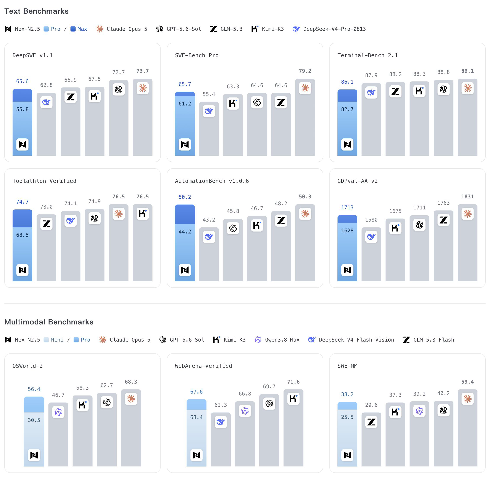

<div align="center">

</div>

---

<div align="center">
<p>
  💻 <a href="https://github.com/nex-agi/Nex-N2.5">GitHub</a>&nbsp; · &nbsp;
  🤗 <a href="https://huggingface.co/collections/nex-agi/nex-n25">Hugging Face</a>&nbsp; · &nbsp;
  🌐 <a href="https://nex-agi.com/">Website</a>&nbsp; · &nbsp;
  🔀 <a href="https://openrouter.ai/nex-agi/nex-n2.5-pro">OpenRouter (Pro)</a>&nbsp; · &nbsp;
  🔀 <a href="https://openrouter.ai/nex-agi/nex-n2.5-mini">OpenRouter (mini)</a>
</p>
</div>

# Nex-N2.5

**A next-generation family of agentic models built for long-horizon tasks in real-world environments.**

Today, Nex-AGI officially introduces **Nex-N2.5**, its next-generation family of agentic models.

Nex-N2.5 is available in three sizes: **mini**, **Pro**, and **Max**. Nex-N2.5-mini and Nex-N2.5-Pro continue to build on the multimodal foundations of Nex-N2, with focused improvements in computer use, web browsing, and visually grounded agentic capabilities. Nex-N2.5-Max is built on a 1.6-trillion-parameter, text-only Mixture-of-Experts (MoE) foundation model, marking our first complete post-training effort at trillion-parameter scale.

For long-horizon tasks in real-world environments, Nex-N2.5 further strengthens its ability to act continuously and self-correct through visual feedback. The models can operate computers and browsers, as well as autonomously execute and test programs. Vision is therefore no longer merely an input modality; it has become a critical interface through which an agent perceives its environment, verifies outcomes, and moves a task forward.

Building on this foundation, we have further expanded the range of agent training environments, task types, and productivity scenarios, while completing systematic post-training at trillion-parameter scale for the first time. Through broader task coverage and richer environmental feedback, Nex-N2.5 delivers further gains in scientific research, knowledge work, and complex productivity tasks. This work also provides valuable practical experience for training agentic capabilities in even larger models.

By jointly advancing model training, infrastructure, and real-world agent scenarios, Nex-AGI aims to continue driving progress in agentic intelligence.

## Open Source

Model weights for the Nex-N2.5 family will be released as open source, alongside hosted online services.

- **Nex-N2.5-Max:** [Hugging Face](https://huggingface.co/nex-agi/Nex-N2.5-Max) | [ModelScope](https://modelscope.cn/models/nex-agi/Nex-N2.5-Max)
- **Nex-N2.5-Pro:** [Hugging Face](https://huggingface.co/nex-agi/Nex-N2.5-Pro) | [ModelScope](https://modelscope.cn/models/nex-agi/Nex-N2.5-Pro)
- **Nex-N2.5-mini:** [Hugging Face](https://huggingface.co/nex-agi/Nex-N2.5-mini) | [ModelScope](https://modelscope.cn/models/nex-agi/Nex-N2.5-mini)
- **Hosted Access:** [OpenRouter (Nex-N2.5-Pro)](https://openrouter.ai/nex-agi/nex-n2.5-pro) | [OpenRouter (Nex-N2.5-mini)](https://openrouter.ai/nex-agi/nex-n2.5-mini)
- **Websites:** [Global](https://nex-agi.com/)

We welcome developers and enterprises to integrate and try Nex-N2.5 and share their feedback.

## Performance

We evaluate Nex-N2.5 across coding, agentic workflows, computer use, and multimodal understanding.



The tables below compare **Nex-N2.5-mini**, **Nex-N2.5-Pro**, and **Nex-N2.5-Max** with leading models across our evaluation suite.<sup><a href="#benchmark-note-1">1</a>, <a href="#benchmark-note-2">2</a></sup> **Bold** marks the best result in each benchmark, including ties; — indicates unavailable data.<sup><a href="#benchmark-note-10">10</a></sup>

### Text Benchmarks

<!-- Keep benchmark rows first in each tbody; only section labels receive GitHub's alternating row background. -->
<table>
  <thead>
    <tr>
      <th align="left">Benchmark</th>
      <th align="center">Nex-N2.5-mini</th>
      <th align="center">Nex-N2.5-Pro</th>
      <th align="center">Nex-N2.5-Max</th>
      <th align="center">Claude Opus 5</th>
      <th align="center">GPT-5.6 Sol</th>
      <th align="center">Kimi-K3</th>
      <th align="center">GLM-5.3</th>
      <th align="center">DeepSeek-V4-Pro-0813<sup><a href="#benchmark-note-4">4</a></sup></th>
      <th align="center">Qwen3.8-Max</th>
    </tr>
    <tr>
      <th colspan="10" align="left">CODING<sup><a href="#benchmark-note-3">3</a></sup></th>
    </tr>
  </thead>
  <tbody>
    <tr><td>Terminal-Bench 2.1</td><td align="center">73.4</td><td align="center">82.7</td><td align="center">86.1</td><td align="center"><b>89.1</b></td><td align="center">88.8</td><td align="center">88.3</td><td align="center">88.2</td><td align="center">87.9</td><td align="center">86.6</td></tr>
  </tbody>
  <tbody>
    <tr><td>SWE-Bench Pro</td><td align="center">43.8</td><td align="center">61.2</td><td align="center">65.7</td><td align="center"><b>79.2</b></td><td align="center">64.6</td><td align="center">63.3</td><td align="center">64.6</td><td align="center">55.4</td><td align="center">67.7</td></tr>
  </tbody>
  <tbody>
    <tr><td>DeepSWE v1.1</td><td align="center">36.1</td><td align="center">55.8</td><td align="center">65.6</td><td align="center"><b>73.7</b></td><td align="center">72.7</td><td align="center">67.5</td><td align="center">66.9</td><td align="center">62.8</td><td align="center">69.3</td></tr>
    <tr><th colspan="10" align="left">AGENTIC</th></tr>
  </tbody>
  <tbody>
    <tr><td>AutomationBench v1.0.6<sup><a href="#benchmark-note-5">5</a></sup></td><td align="center">32.3</td><td align="center">44.2</td><td align="center">50.2</td><td align="center"><b>50.3</b></td><td align="center">45.8</td><td align="center">46.7</td><td align="center">48.2</td><td align="center">43.2</td><td align="center">39.8</td></tr>
  </tbody>
  <tbody>
    <tr><td>Toolathlon Verified</td><td align="center">54.6</td><td align="center">68.5</td><td align="center">74.7</td><td align="center"><b>76.5</b></td><td align="center">74.9</td><td align="center"><b>76.5</b></td><td align="center">73.0</td><td align="center">74.1</td><td align="center">72.5</td></tr>
  </tbody>
  <tbody>
    <tr><td>GDPval-AA v2</td><td align="center">1446</td><td align="center">1628</td><td align="center">1713</td><td align="center"><b>1831</b></td><td align="center">1711</td><td align="center">1675</td><td align="center">1763</td><td align="center">1580</td><td align="center">1717</td></tr>
  </tbody>
  <tbody>
    <tr><td>Job Bench</td><td align="center">28.5</td><td align="center">41.4</td><td align="center">53.6</td><td align="center"><b>65.7</b></td><td align="center">45.4</td><td align="center">52.9</td><td align="center">58.2</td><td align="center">54.1</td><td align="center">53.4</td></tr>
  </tbody>
  <tbody>
    <tr><td>BrowseComp<sup><a href="#benchmark-note-6">6</a></sup></td><td align="center">83.4</td><td align="center">89.7</td><td align="center"><b>92.6</b></td><td align="center">90.8</td><td align="center">90.4</td><td align="center">91.2</td><td align="center">—</td><td align="center">—</td><td align="center">—</td></tr>
  </tbody>
</table>

### Multimodal Benchmarks

<table>
  <thead>
    <tr>
      <th align="left">Benchmark</th>
      <th align="center">Nex-N2.5-mini</th>
      <th align="center">Nex-N2.5-Pro</th>
      <th align="center">MiniMax-M3</th>
      <th align="center">Claude Opus 5</th>
      <th align="center">GPT-5.6 Sol</th>
      <th align="center">Kimi-K3</th>
      <th align="center">GLM-5.3-Flash</th>
      <th align="center">DeepSeek-V4-Flash-Vision</th>
      <th align="center">Qwen3.8-Max</th>
    </tr>
  </thead>
  <tbody>
    <tr><td>OSWorld-Verified<sup><a href="#benchmark-note-8">8</a></sup></td><td align="center">71.2</td><td align="center">82.2</td><td align="center">75.2</td><td align="center">83.4</td><td align="center">83.2</td><td align="center">84.8</td><td align="center">62.3</td><td align="center">76.7</td><td align="center"><b>86.1</b></td></tr>
  </tbody>
  <tbody>
    <tr><td>OSWorld-2</td><td align="center">30.5</td><td align="center">56.4</td><td align="center">22.3</td><td align="center"><b>68.3</b></td><td align="center">62.7</td><td align="center">58.3</td><td align="center">—</td><td align="center">—</td><td align="center">46.7</td></tr>
  </tbody>
  <tbody>
    <tr><td>WebTest<sup><a href="#benchmark-note-8">8</a>, <a href="#benchmark-note-9">9</a></sup></td><td align="center">48.6</td><td align="center">52.8</td><td align="center">—</td><td align="center">—</td><td align="center"><b>54.0</b></td><td align="center">—</td><td align="center">—</td><td align="center">—</td><td align="center">52.3</td></tr>
  </tbody>
  <tbody>
    <tr><td>WebArena-Verified<sup><a href="#benchmark-note-8">8</a></sup></td><td align="center">63.4</td><td align="center">67.6</td><td align="center">—</td><td align="center">—</td><td align="center">69.7</td><td align="center"><b>71.6</b></td><td align="center">—</td><td align="center">62.3</td><td align="center">66.8</td></tr>
  </tbody>
  <tbody>
    <tr><td>OSWorld-G</td><td align="center">82.9</td><td align="center"><b>87.4</b></td><td align="center">—</td><td align="center">76.8</td><td align="center">77.7</td><td align="center">79.6</td><td align="center">83.3</td><td align="center">59.4</td><td align="center">84.9</td></tr>
  </tbody>
  <tbody>
    <tr><td>Vision2Web<sup><a href="#benchmark-note-7">7</a></sup></td><td align="center">52.9</td><td align="center">68.2</td><td align="center">59.0</td><td align="center">—</td><td align="center"><b>79.8</b></td><td align="center">—</td><td align="center">—</td><td align="center">—</td><td align="center">75.1</td></tr>
  </tbody>
  <tbody>
    <tr><td>SWE-MM</td><td align="center">25.5</td><td align="center">38.2</td><td align="center">—</td><td align="center"><b>59.4</b></td><td align="center">40.2</td><td align="center">37.3</td><td align="center">20.6</td><td align="center">39.2</td><td align="center">39.2</td></tr>
  </tbody>
  <tbody>
    <tr><td>OmniDoc</td><td align="center">89.7</td><td align="center">92.2</td><td align="center">91.6</td><td align="center">—</td><td align="center"><b>92.9</b></td><td align="center">91.1</td><td align="center">—</td><td align="center">—</td><td align="center">92.1</td></tr>
  </tbody>
</table>

<p id="benchmark-note-1"><sup>1</sup> <b>Score sources:</b> Where available, scores are drawn from official benchmark leaderboards and the latest evaluation reports published by model providers, including the Kimi-K3, Qwen3.8-Max, GLM-5.3, and HY4 reports. Results without a public source are obtained through our own evaluations.</p>
<p id="benchmark-note-2"><sup>2</sup> <b>Sampling parameters:</b> Our evaluations use <code>temperature = 0.7</code>, <code>top_p = 0.95</code>, and <code>top_k = 40</code>.</p>
<p id="benchmark-note-3"><sup>3</sup> <b>Evaluation harness:</b> Coding tasks are evaluated using the <a href="https://github.com/nex-agi/NexAU">NexAU</a> harness.</p>
<p id="benchmark-note-4"><sup>4</sup> <b>DeepSeek-V4-Pro:</b> Our evaluations use the DeepSeek-V4-Pro-0813 version.</p>
<p id="benchmark-note-5"><sup>5</sup> <b>AutomationBench:</b> We use the Public version.</p>
<p id="benchmark-note-6"><sup>6</sup> <b>BrowseComp:</b> We apply the Summary context-compaction strategy when the token usage exceeds 60% of the model’s context window.</p>
<p id="benchmark-note-7"><sup>7</sup> <b>Vision2Web:</b> We report the average score across the Frontend, Webpage, and Website categories, with Gemini-3.5-Flash as the VLM judge and GLM-5V-Turbo (Claude Code) as the GUI agent.</p>
<p id="benchmark-note-8"><sup>8</sup> Computer-use and browser-use benchmarks, including OSWorld, WebTest, and WebArena, are evaluated using our NexCUA harness. Grounding coordinates are normalized to a 0–1000 scale. The NexCUA project will be open-sourced soon.</p>
<p id="benchmark-note-9"><sup>9</sup> <b>WebTestBench:</b> These results are evaluated in <b>oracle mode</b>, using the ground-truth checklist to assess defect detection only, without checklist generation.</p>
<p id="benchmark-note-10"><sup>10</sup> <b>Notation:</b> Bold marks the best result in each benchmark, including ties; — indicates unavailable data.</p>

## Usage

### Docker Deployment

We also provide a prebuilt Docker image with our customized `sglang` fork preinstalled: **`nexagi/sglang:v0.5.18-nex-patch`**. The launch command is the same as above.

#### Nex-N2.5-Max

```bash
# Multi-node (2 nodes, 16 x H200). Run the same command on every node with:
#   <node-rank> = 0 on the head node, 1 on the other node
#   <node0-ip>  = IP of the head node (reachable from all others)
docker run --gpus all --shm-size 32g --network host \
  -v /path/to/your/model:/model \
  nexagi/sglang:v0.5.18-nex-patch \
  python3 -m sglang.launch_server \
    --model-path /path/to/your/model \
    --trust-remote-code \
    --host 0.0.0.0 \
    --port 8000 \
    --nnodes 2 \
    --node-rank "${NODE_RANK}" \
    --dist-init-addr "${MASTER_ADDR}:5000" \
    --tp 16 \
    --pp-size 1 \
    --dp 1 \
    --ep-size 16 \
    --attention-backend dsv4 \
    --kv-cache-dtype fp8_e4m3 \
    --page-size 256 \
    --moe-a2a-backend deepep \
    --moe-runner-backend deep_gemm \
    --moe-dense-tp-size 1 \
    --deepep-mode auto \
    --context-length 262144 \
    --mem-fraction-static 0.84 \
    --chunked-prefill-size 8192 \
    --enable-mixed-chunk \
    --disable-overlap-schedule \
    --max-running-requests 64 \
    --cuda-graph-max-bs-decode 64 \
    --cuda-graph-backend-decode full \
    --cuda-graph-backend-prefill disabled \
    --chat-template /path/to/nex-n2.5-max/chat_template.jinja \
    --reasoning-parser deepseek-r1 \
    --tool-call-parser qwen3_coder
```

#### Nex-N2.5-Pro

Single node with 8 × H100:

```bash
docker run --gpus all --shm-size 32g --ipc=host \
  -p 30000:30000 \
  -v /path/to/your/model:/model \
  nexagi/sglang:v0.5.18-nex-patch \
  python3 -m sglang.launch_server \
    --model-path /model \
    --tp 8 \
    --host 0.0.0.0 --port 30000 \
    --reasoning-parser qwen3 \
    --tool-call-parser qwen3_coder \
    --chat-template /path/to/nex-N2.5-Pro/chat-template.jinja \
    --mamba-scheduler-strategy extra_buffer
```

#### Nex-N2.5-mini

Single node with 2 × H100:

```bash
docker run --gpus all --shm-size 32g --ipc=host \
  -p 30000:30000 \
  -v /path/to/your/model:/model \
  nexagi/sglang:v0.5.18-nex-patch \
  python3 -m sglang.launch_server \
    --model-path /model \
    --tp 2 \
    --host 0.0.0.0 --port 30000 \
    --reasoning-parser qwen3 \
    --tool-call-parser qwen3_coder \
    --chat-template /path/to/nex-N2.5-mini/chat-template.jinja \
    --mamba-scheduler-strategy extra_buffer
```

### Recommended Sampling Parameters

For the best generation quality, we recommend the following sampling parameters:

- `temperature`: 0.7
- `top_p`: 0.95
- `top_k`: 40

### Thinking Modes

Use `reasoning_effort` to control the thinking behavior of Nex-N2.5:

| `reasoning_effort` | Mode | Behavior |
| --- | --- | --- |
| `"none"` | Non-thinking | Respond directly without a reasoning trace. |
| `"medium"` (default) | Adaptive thinking | Let the model decide whether and how much to think before responding. |
| `"high"` | Thinking | Always enable thinking before responding. |

For adaptive thinking, set `reasoning_effort` to `"medium"` in your OpenAI-compatible Chat Completions request. Replace `<served-model-name>` with the model name exposed by your server:

```json
{
  "model": "<served-model-name>",
  "messages": [
    {"role": "user", "content": "Explain how binary search works."}
  ],
  "reasoning_effort": "medium"
}
```

The chat template uses `reasoning_effort`; parameters such as `enable_thinking` and `thinking_mode` require gateway-specific translation.

### Function Calling

Nex-series models support robust function-calling capabilities. To enable function calling, add the `--tool-call-parser qwen3_coder` flag when launching the server:

```bash
python -m sglang.launch_server --model-path /path/to/your/model --tool-call-parser qwen3_coder
```

### Reasoning Parser

When the model produces a reasoning trace, configure SGLang to separate it from the final response:

- **Nex-N2.5-mini and Nex-N2.5-Pro:** `--reasoning-parser qwen3`
- **Nex-N2.5-Max:** `--reasoning-parser deepseek-r1`

The deployment commands above include the appropriate reasoning parser and `--tool-call-parser qwen3_coder`. The parser extracts reasoning content; use `reasoning_effort` to select the thinking mode.
